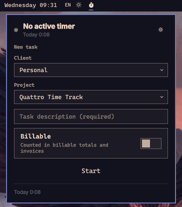

<div align="center">

# OmaTrack

**Freelance and project time tracking for Omarchy.**

OmaTrack is a time tracking plugin for the [Omarchy](https://omarchyplugins.com/) Quattro shell. It puts a live timer in your bar, a quick-start popup one click away, and a full dashboard for managing your entries, clients, projects, reports, and invoices. All data stays local in a single JSON file — no database, no cloud, no telemetry.


<br><br>



</div>

## Features

- **Live bar timer** — current task and elapsed time in the bar. Click it to open the quick-start popup.
- **Quick-start popup** — start, pause, resume, or stop a task in one screen, with your last client and project pre-selected.
- **Dashboard** — a toplevel window with seven tabs:

  | Tab | What it does |
  | --- | --- |
  | **Timer** | Live timer hero plus start/pause/resume/stop, new-task form, and manual entry form |
  | **Entries** | Filterable, paginated log — add, edit, delete |
  | **Clients & Projects** | Manage both, with referential-integrity guards |
  | **Reports** | Totals by day / client / project over any date range, export to CSV or HTML |
  | **Invoices** | Billable entries for one client and range → numbered HTML invoice at your hourly rate |
  | **Settings** | Currency, hourly rate, invoice identity and numbering |

- **CLI-driven** — `omarchy-shell omatrack start|stop|pause|resume|toggle|status` drives the timer from anywhere, and `python3 omatrack.py -h` exposes the full command set.
- **Lightweight** — no database, no polling, no extra processes: one JSON state file, written atomically by a stdlib-only `python3` helper.

## Requirements

- Omarchy with the Quattro shell
- `python3` (standard library only)
- `xdg-open` (opens CSV/HTML exports)

## Install

```sh
omarchy plugin add https://github.com/Sh1d0w/omatrack.git --enable
```

`plugin add` clones the repository into the plugin folder (the registry
forbids symlinks, so a real clone is required) and enables the plugin.
Update it later with `omarchy plugin update io.github.sh1d0w.omatrack`.

## Uninstall

```sh
omarchy plugin remove io.github.sh1d0w.omatrack
```

To also remove your data:

```sh
rm ~/.local/state/omarchy/omatrack/state.json
```

## Usage

- **Bar** — click the timer icon for the popup: start/stop the current task or set up the next one (client, project, description, billable).
- **Dashboard** — `omarchy-shell shell toggle io.github.sh1d0w.omatrack`, optionally with `'{"tab":"entries"}'` (tab ids: `timer`, `entries`, `clients`, `projects`, `reports`, `invoices`, `settings`).
- **CLI** — `omarchy-shell omatrack start|stop|pause|resume|toggle|status|ping` for the timer; `python3 omatrack.py -h` for entries, reports, clients, projects, invoices, and settings.

## Data & privacy

Everything is local: `~/.local/state/omarchy/omatrack/state.json` (`XDG_STATE_HOME` honored), written atomically under an exclusive file lock. No network, no telemetry. Delete the state file to start over.

## Development

- Repo layout, architecture, and per-feature docs live in [docs/](docs/) — [overview](docs/overview.md), [architecture](docs/architecture.md), [bar widget](docs/bar-widget.md), [popup](docs/popup.md), [dashboard](docs/dashboard.md), [entries](docs/entries.md), [clients & projects](docs/clients-projects.md), [reports & export](docs/reports-export.md), [invoices](docs/invoices.md), [settings & CLI](docs/settings.md).
- Test suite: `bash tests/helper_test.sh` (99 checks against a throwaway `XDG_STATE_HOME`).
- Dev loop: edit → re-run the single local-install command (AGENTS.md → Dev loop) → the shell hot-reloads saved plugin files.

## License

[MIT](LICENSE) © sh1d0w
