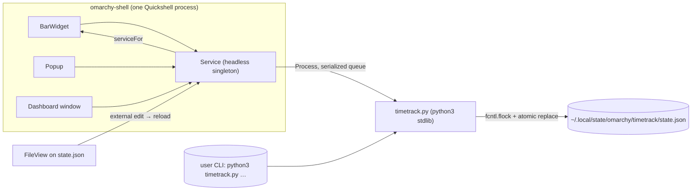

# Architecture

## Channels

The shell is one long-running Quickshell process. The plugin runs in-process
(unsandboxed); `timetrack.py` is the only out-of-process piece, spawned per
action and never kept alive.



## The single-writer rule

Every mutation — UI or CLI — goes through `timetrack.py`. QML never writes the
state file. The helper:

- takes an exclusive `fcntl.flock` on `state.json`'s sibling `.lock` for
  read-modify-write (shared lock for pure reads),
- writes atomically: `mkstemp` in the same directory → `fsync` → `os.replace`,
- prints exactly one JSON line on stdout:
  `{"ok": true, ...}` (exit 0) or `{"ok": false, "error": "<msg>"}` (exit 1).

`Service.qml` serializes its own helper calls: one `Process` object, a
`_queue` of pending `[args, callback]` pairs, and `_pending` for the in-flight
call. A `FileView` on `state.json` reloads the view when the file changes
while no helper run is in flight — so edits made from the CLI appear in the
UI without any polling.

## State file

Location: `$XDG_STATE_HOME/omarchy/timetrack/` (default
`~/.local/state/omarchy/timetrack/`):

```
state.json    the state (below)
.lock         flock file (never read as data)
invoices/     generated invoice HTML
exports/      generated CSV/HTML timesheets
```

`state.json` (version 1):

```json
{
  "version": 1,
  "settings": {
    "currency": "EUR",
    "hourlyRate": 0,
    "invoice": {
      "companyName": "", "companyAddress": "", "taxRate": 0,
      "numberPrefix": "INV-", "nextNumber": 1, "footer": ""
    }
  },
  "clients":  [{ "id": "c_<hex12>", "name": "Acme", "createdAt": "<utc iso>" }],
  "projects": [{ "id": "p_<hex12>", "clientId": "c_…", "name": "Landing page" }],
  "entries": [{
    "id": "e_<hex12>", "clientId": "c_…", "projectId": "p_…",
    "description": "Hero section", "billable": true,
    "start": "2026-08-18T08:00:00+00:00",
    "end":   "2026-08-18T09:30:00+00:00",
    "seconds": 5400
  }],
  "active": null
}
```

- Timestamps are **UTC ISO-8601, second precision**. Local time is used only
  where a command documents it (manual-entry date/time, day totals, date-only
  range bounds).
- `active` is an entry without `end`/`seconds` while a timer runs — it is
  written to disk **immediately on start**, which is what makes a running
  timer survive shell restarts.
- IDs: `c_`/`p_`/`e_` + 12 hex chars of `uuid4`.

## What QML holds (the "view")

Helper mutation responses and `init`/`state` return a compact view — state
minus the entries array, plus:

- `lastUsed` — the most recently ended entry (or the active task): the
  popup's pre-selected defaults,
- `daySeconds` / `dayBillableSeconds` — local-today totals,
- `entryCount` — total number of entries (never the entries themselves).

Entries reach QML only in pages: `entries --offset N --limit 50` (the UI
always uses limit 50). The full entries array never enters the process.

## The 1s tick

`Service.qml` contains the plugin's only periodic source:

```qml
SystemClock { precision: SystemClock.Seconds; enabled: root.running }
```

It is a C++ clock (no JS `Timer`, no process, no disk) and is **disabled
while idle**, so the idle state has zero churn. `elapsedSeconds` is derived:
`floor(now − active.start)`; the bar and popup bind to `elapsedLabel`.

## Timer semantics

- `start` persists `active` at once (see above).
- **Pause = stop**: the entry is closed with `end = now` and appended to
  `entries`. **Resume = a new entry** (`start` again). This keeps every
  entry a simple, immutable-after-stop interval.
- `stop` accepts an `--at` ISO override (naive = UTC) for corrections.
- Duration is `max(0, int(end − start))` seconds; sub-second usage is 0.

## Hot reload vs. shell restart

- Saving any file under `~/.config/omarchy/plugins/` hot-reloads the shell's
  QML: bar widget, popup, dashboard, views update in place.
- **Exception:** a changed `Service.qml` may not reload an already-running
  service instance. `omarchy restart shell` is the reliable path — and it is
  also the restart-resilience test, since a running timer is on disk and
  comes back on load (`Service.Component.onCompleted → init → applyView`).

## Performance budget

| Source            | Cost while idle | Cost while a timer runs |
|-------------------|-----------------|--------------------------|
| QML polling       | none (no `Timer` loops anywhere) | none |
| `SystemClock`     | disabled        | one 1s C++ tick → relabel |
| `timetrack.py`    | not running     | not running (elapsed is computed in QML) |
| disk I/O          | none            | none |
| `FileView` watch  | kernel inotify, no work | same |

The helper runs only on user actions (start/stop/mutate/query/export/invoice),
typically <50 ms each.
